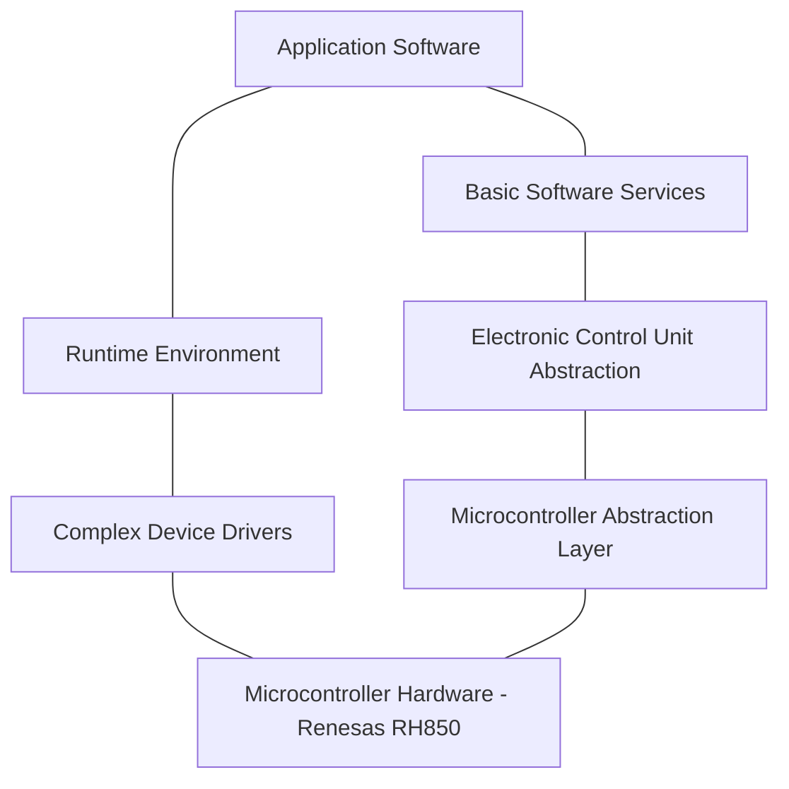

The software follows the AUTOSAR (AUTomotive Open System ARchitecture) layered
model. Each repository directory belongs to exactly one layer; the
documentation mirrors that structure.

## Layers in this project

| Layer | Short name | What lives here | Documentation |
|---|---|---|---|
| Application Software | Application Software (ASW) | Steering functions, customer functions, communication proxies, diagnostics, manufacturing services | [Application Software](/application-software/) |
| Complex Device Drivers | Complex Device Drivers (CDD) | Microcontroller configuration, sensing, actuation, power electronics | [Complex Device Drivers](/complex-device-drivers/) |
| Basic Software Services | Basic Software Services (BSW Services) | Mode management, diagnostics, memory, watchdog, calibration | [Basic Software Services](/basic-software-services/) |
| Electronic Control Unit Abstraction | Electronic Control Unit Abstraction (BSW ECU Abstraction) | Input Output Hardware Abstraction, memory abstraction, watchdog interface | [Electronic Control Unit Abstraction](/ecu-abstraction/) |
| Microcontroller Abstraction Layer | Microcontroller Abstraction Layer (MCAL) | Microcontroller, port, digital input output, serial peripheral interface, flash, watchdog and Controller Area Network drivers | [Microcontroller Abstraction Layer](/microcontroller-abstraction-layer/) |
| Communication Stack | Communication Stack (BSW Communication) | Interaction layer, transport protocol, network management, diagnostics | [Communication Stack](/communication-stack/) |
| Operating System and Runtime Environment | Operating System and Runtime Environment (BSW System) | Operating system and runtime environment | [Operating System and Runtime](/operating-system-and-runtime/) |
| Libraries | Libraries (LIB) | Mathematics, interpolation, fixed-point, filtering libraries and global parameters | [Libraries](/libraries/) |
| Tools and Support | Tools (host-side) | Generators, configurators, static analysis and support packages | [Tools and Support](/tools-and-support/) |
| System Integration | Integration | Top-level integration project for the controller and vehicle platform | [System Integration](/integration/) |

